# Multi-output Gaussian Processes - MATLAB Software

Multiple output Gaussian processes in MATLAB including the latent force model.

This page describes examples of how to use the Multi-output Gaussian Process Software (MULTIGP).

This software depends on the <a href="https://github.com/SheffieldML/GPmat">GPmat repository software</a>.

### Old Release Numbers

Contains updates to the code for the technical report.

#### Version 0.11


Updates to allow variational outputs for working with latent functions

that are white noise processes.


#### Version 0.1 

This is the very first version of the multi-ouput Gaussian Process
toolbox. It shows toy examples for a full covariance model and two
approximations proposed in the paper <a
href="ftp://ftp.cs.man.ac.uk/pub/ai/neill/spmulti.pdf">Sparse
Convolved Gaussian Processes for Multi-ouput regression</a>

## Examples

### Multi-output Gaussian process using a Gaussian kernel and a Gaussian covariance function

This example shows how it is possible to make multiple regression
over four outputs using a Gaussian process constructed with the
convolution process approach. Note that there are some ranges of
missing data for outputs one and four.

```octave
>> demGpToy1
```
<center>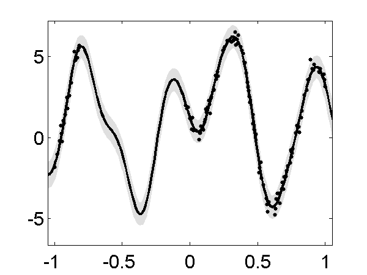<br> <i>Left</i> First output in the four outputs of the demo. <i>Right</i> Fourth output for the same example. </center>

### Multi-output Gaussian process using the PITC approximation and the FITC approximation (fixed inducing points)

In the <a href="ftp://ftp.cs.man.ac.uk/pub/ai/neill/spmulti.pdf">paper</a>, two approximations that exploit conditional independencies in the model were proposed. Due to their similarities with the PITC and FITC approximations for the one output case, these multi-output approximations are named in a similar way. For PITC run

```octave
>> demSpmgpGgToy1
```

For FITC run 

```octave
>> demSpmgpGgToy2
```

<center>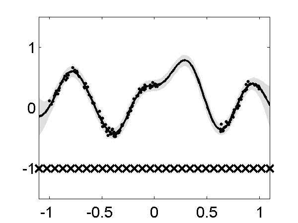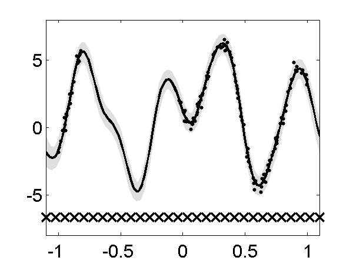<br> 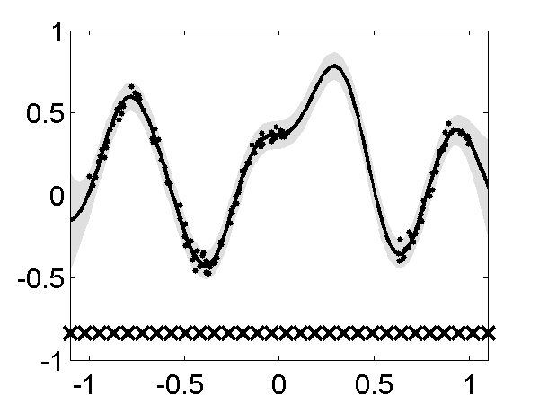<br><i>Up</i> The same two outputs using PITC <i>Down</i> The same two outputs using FITC.</center>


### Multi-ouput Gaussian processes for the Swiss Jura Dataset (only PITC)


The experiment for the Swiss Jura Dataset using the full covariance
matrix can be recreated using ( you will need to obtain the files
prediction.dat and validation.dat from <a href="http://goovaerts.pierre.googlepages.com/">here</a>. Go to the Publications link and then to the Book link)

```octave
>> demGgJura
```
The result with the approximation can be recreated using


```octave
>> demSpmgpGgJura
```

<center>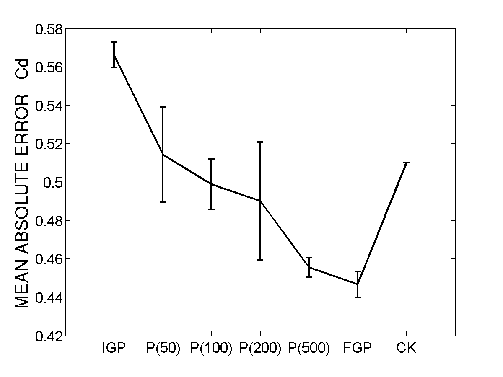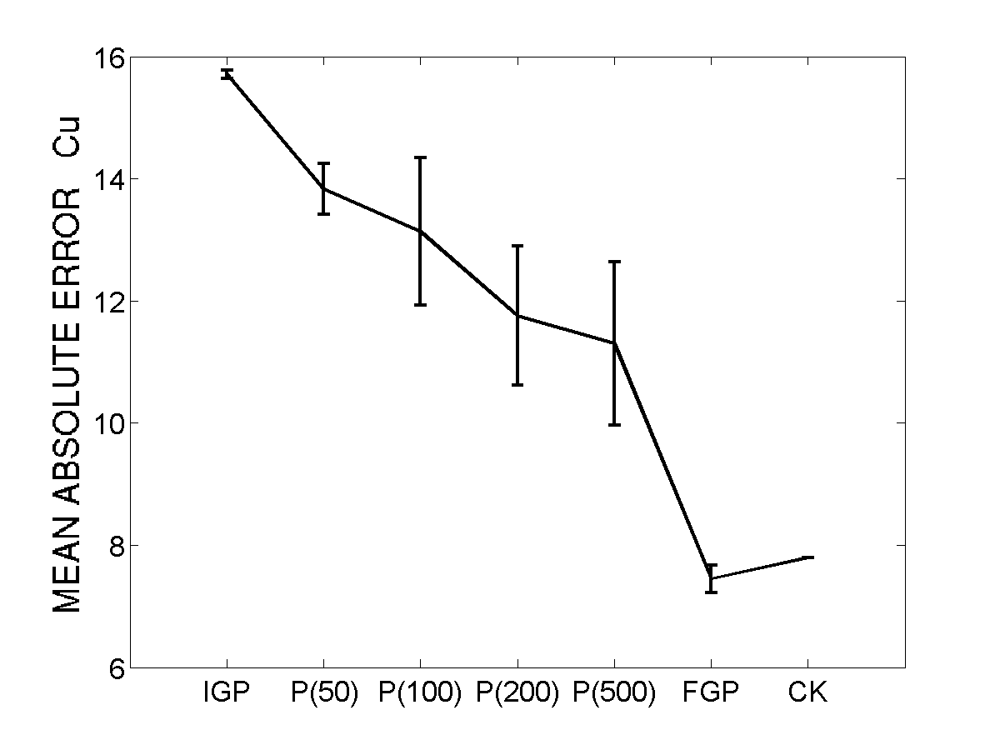

Mean absolute error and standard deviation for ten repetitions of the experiment for the Jura dataset In the bottom of each figure, IGP stands for independent GP, P(M) stands for PITC with M inducing values, FGP stands for full GP and CK stands for ordinary co-kriging. On the left, regression over Cadmium (Cd) and on the right, regression over Copper (Cu) </center>

###  Sparse approximations for convolved multiple output Gaussian processes.


We generate a toy dataset consisting of four outputs, one latent
function and one input dimension. The training data was sampled from
the full GP.  We generate 500 observation points for each output and
use 200 observation points (per output) for training the full and the
sparse multiple output GP.  The figure 2 shows the training
result. The predictions shown correspond to the full GP, the DTC
approximation, the FITC approximation and the PITC approximation. For
details of the setup refer to the <a href="ftp://ftp.cs.man.ac.uk/pub/ai/neill/sparseMultigpRed.pdf">paper</a>. The difference with the previous toy example is that for this case we optimize the position of the inducing inputs.  

To run the full GP, use

```octave
>> toy1DGgFTCExample
```

To run the DTC approximation, use

```octave
>> toy1DGgDTCExample.m
```


 To run the FITC approximation, use


```octave
>> toy1DGgFITCExample.m
```

To run the PITC approximation, use

```octave
>> toy1DGgPITCExample.m
```
<center>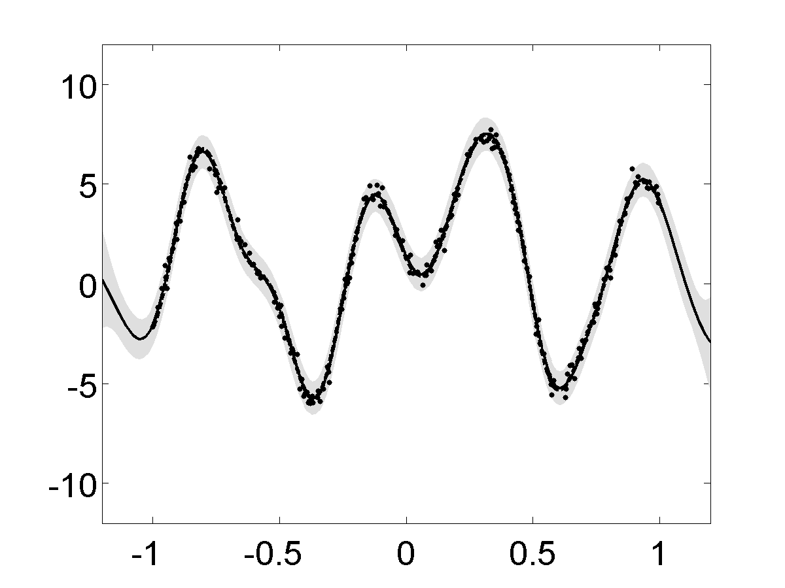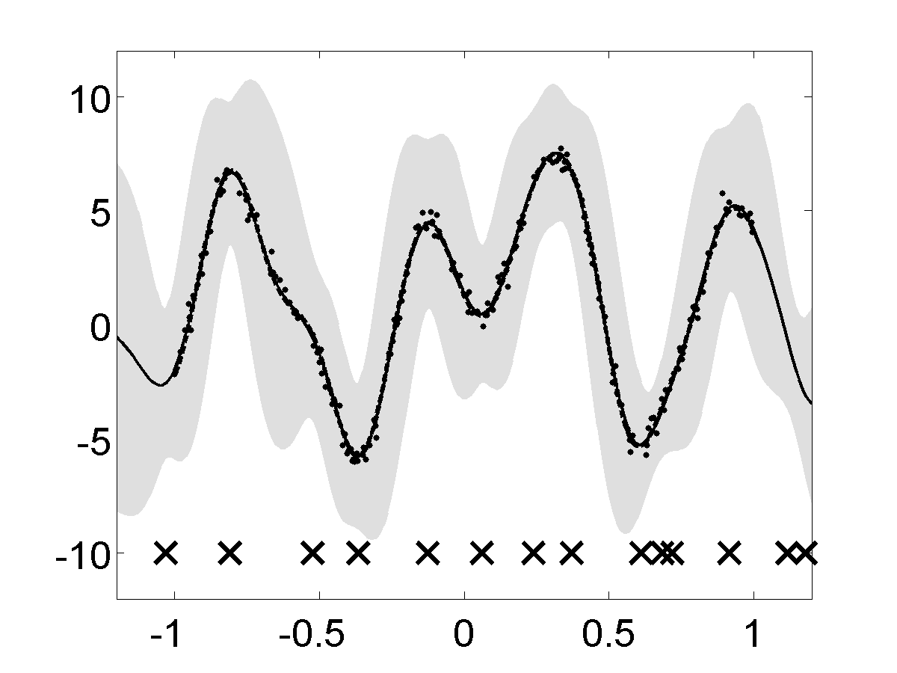<br> 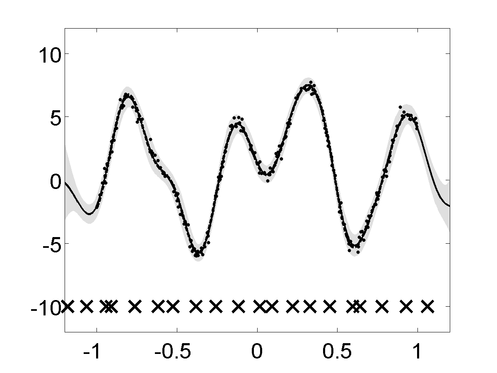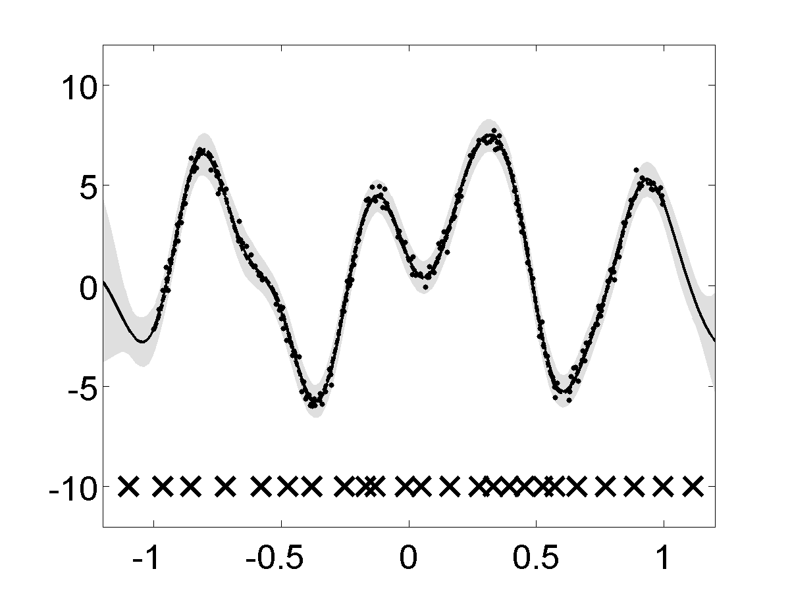<br><i>Up, Left</i> Output four using full GP. <i>Up, Right </i> Output four using the DTC approximation. <i><Down, Left</i> Output four using the FITC approximation. <i>Down, Right</i> Output four using the PITC approximation.  </center> 


### School exam score prediction. 


The goal is to predict the exam score obtained by a particular student
belonging to a particular school.  The data comes from the Inner
London Education Authority (ILEA) (this dataset can be obtained <a href="http://www.cmm.bristol.ac.uk/learning-training/multilevel-m-support/datasets.shtml">here</a>).

It consists of examination records from 139 secondary schools in years 1985, 1986 and 1987. It is a random 50% sample with 15362 students. From the multiple output point of view, each school represents one output and the exam score of each student a particular instantiation of that output.  The results in terms of percentage of explained variance are shown in the figure.  

To obtain the DTC approximation result, run

```octave
>> schoolGgDTC
```

To obtain the FITC approximation result, run 

```octave
>> schoolGgFITC
```

To obtain the PITC approximation result, run

```
>> schoolGgPITC.m
```

<center>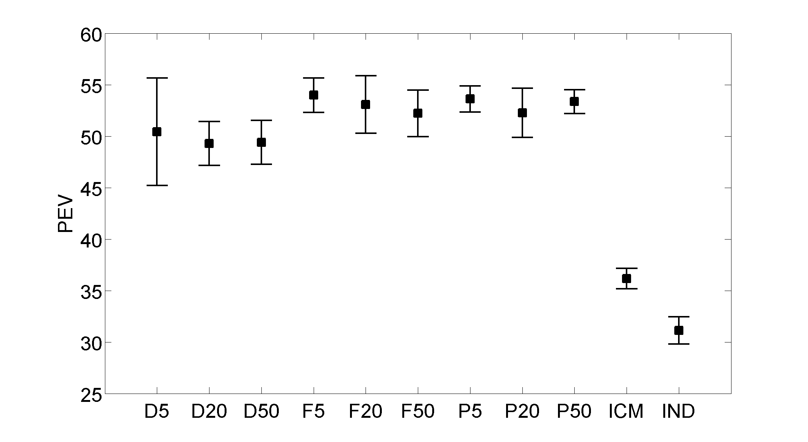<br> Mean and
standard deviation of the percentage of explained variance for exam
score prediction results on the ILEA dataset. The experiment was
repeated ten times. In the bottom of the figure DK, FK, PK stands for
DTC, FITC and PITC with K inducing values, respectively, ICM stands
for intrinsic coregionalization model and IND stands for independent
GPs. The ICM and the independent GPs results were obtained from
Bonilla et al. (2008).  </center>

###  Cell cycle of Yeast.  

The dataset can be obtained <a
href="http://www.cs.manchester.ac.uk/~neill/chipvar/">here</a>. It
contains the expression level for 24 time points of 1935 genes. The
connectivity matrix is also provided. We use the SIM kernel to infer
the activity of the transcription factor ACE2 and the transcription
factor SWI5. Figure shows the shape of the inferred
transcriptions. The PITC approximation is employed with 15 inducing
inputs.

To train the model that allows to infer the transcription factor
proteins in the figure, run

```octave
>> demSpmgpSimYeastSpellmanPitc
```
<center>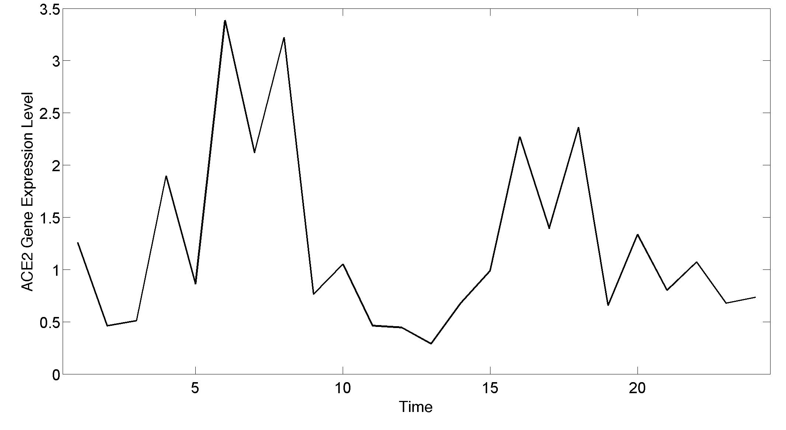<br> 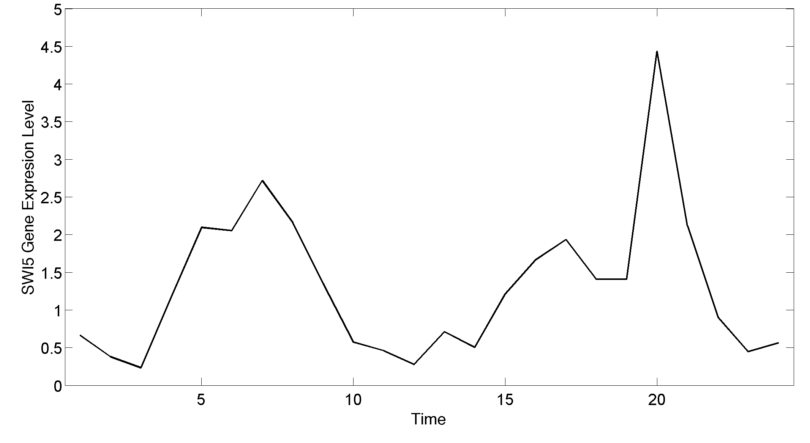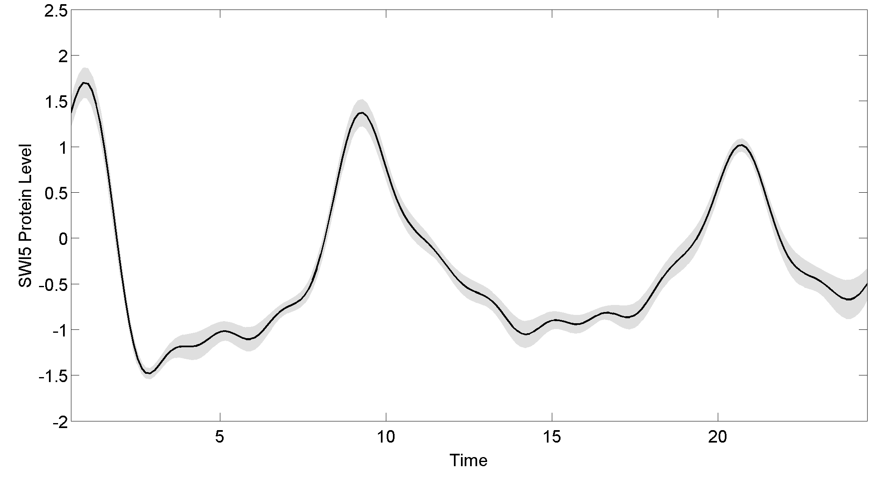

Gene expresion profile and inferred protein concentration for ACE2 and
SWI5. The first column shows the gene expression level. The second
column shows the mean posterior over the transcription factor and two
standard deviations for the uncertainty.  <i>Up, Left</i> Gene
expression profile for ACE2. <i>Up, Right </i> Inferred protein
concentration for ACE2.  <i>Down, Left</i> Gene expression profile for
SWI5. <i>Down, Right</i> Inferred protein concentration for SWI5.